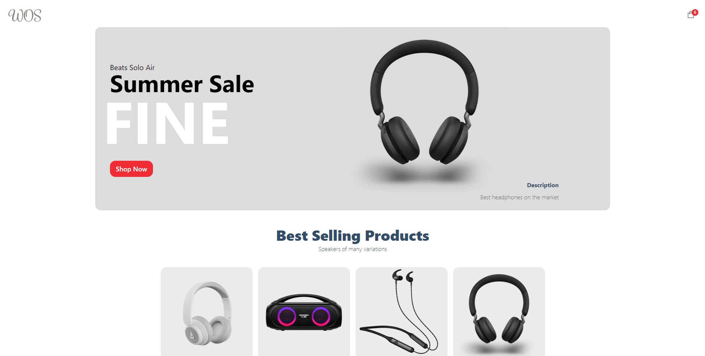

# WOS Ecomerce



WOS ecommerce is a ecomerce website build with nextjs and Sanity.

## Getting Started

First, add your Sanity API key in a .env file in the root folder and name it NEXT_PUBLIC_SANITY_TOKEN.

After, run the development server:

```bash
npm run dev
```
